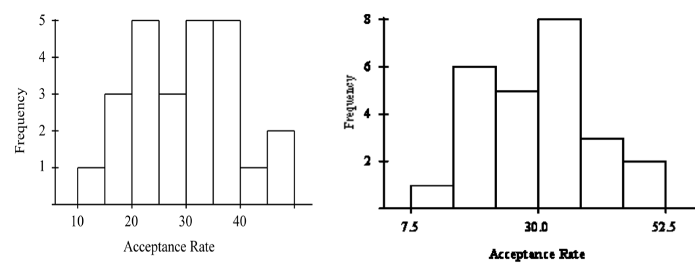
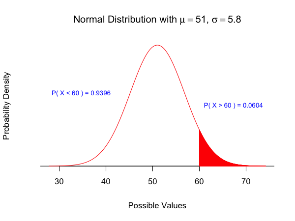
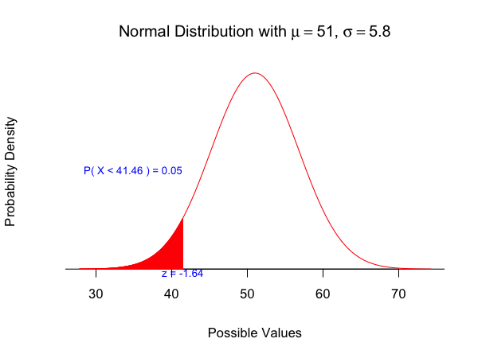
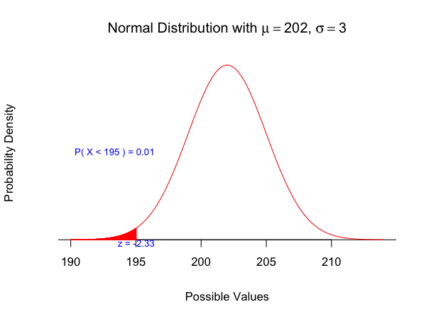
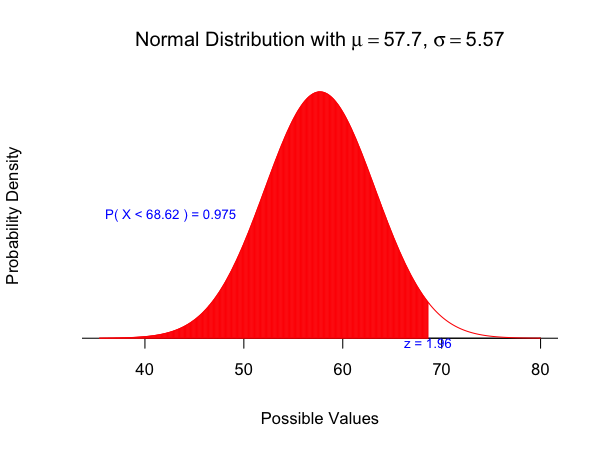
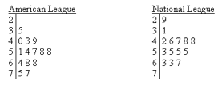

## Question 1 ##

Each of the following two histograms represents the distribution of acceptance rates (percent accepted) among 25 business schools in 2005.  The histograms use different class intervals, but are based on the same data.  In each class interval, the left endpoint is included but not the right. 

--- &radio .quiz

## Question 1A ##

What percent of the schools have an acceptance rate of less than 20%?

1. 12%
2. 3%
3. _16%_
4. 4%

*** explanation

From the histogram on the left, we see that 4 out of the 25 schools have an acceptance rate of < 20%. Hence, the answer is 16%.

--- &radio .quiz

## Question 1B ##

Which interval contains fewer than half of all the observations?
 
1. _[30% , 45%)_
2. [25%, 40%)
3. [22.5%, 37.5%)
4. [20%, 35%)

*** explanation

Inspecting the histogram carefully, we find that only 11 out of 25 schools have an acceptance rate in the range 30% to 45%.

--- &radio .quiz

## Question 2A ##

A study is conducted to determine if one can predict the price of a stock based on the price-to-earnings ratio.  The response variable in this study is:

1. the price-to-earnings ratio.
2. either the NASDAQ or the Dow Jones Industrial Average.
3. the researcher.
4. _price of the stock._

*** explanation

We are trying to predict stock price. Hence it is the response variable

--- &radio .quiz

## Question 2B ##

A researcher is interested in determining if one could predict the score on a statistics exam from the amount of time spent studying for the exam.  In this study, the explanatory variable is:

1. _the amount of time spent studying for the exam._
2. the researcher.
3. the score on the exam.
4. the fact that this is a statistics exam.

*** explanation

We are trying to predict scores based on amount of time spent studying. Hence, the explanatory variable is the amount of time spent studying for the exam.

--- &radio .quiz

## Question 2C ##

When creating a scatterplot, one should:

1. use the vertical axis for the explanatory variable.
2. use a different plotting symbol if the explanatory variable is categorical than if the response variable is categorical.
3. use a plotting scale that makes the overall trend roughly linear.
4. _use the vertical axis for the response variable._

*** explanation

A scatterplot usually displays the response variable on the y-axis and the explanatory variable on the x-axis.

---

## Question 3 ##

A local running club has its own track and keeps accurate records of each member's individual best lap time around the track, so members can make comparisons with their peers. Here are graphs of these data.

--- &radio .quiz

## Question 3A ##

Which of the above graphs allows you to most easily estimate the median running time?

1. Graph A.
2. Graph B.
3. _Graph C._
4. All of the above.

*** explanation

The median can be easily estimated to be around 3.1 by looking at the boxplot (Graph C).

--- &radio .quiz

## Question 3B ##

Which of the above graphs allows you to most easily see the shape of the distribution of running times?

1. _Graph A._
2. Graph B.
3. Graph C.
4. All of the above.

*** explanation

The `histogram` in Graph A allows us to see the distribution of the running times clearly.

--- .quiz &radio

## Question 4A

As part of a survey of college students a researcher is interested in the variable class standing.  She records a 1 if the student is a freshman, a 2 if the student is a sophomore, a 3 if the student is a junior, and a 4 if the student is a senior.  The variable class standing is:

1. _categorical._
2. quantitative.
3. both A and B.
4. neither A nor B.

*** explanation

Although the class standing is recorded as numbers, it is a categorical variable.

--- .quiz &radio

## Question 4B

Responses to a survey are recorded as variables of interest to the researchers.  Below are some of the variables from a survey conducted by the Canada Post.  Which of the variables is categorical?

1. Number of people, both adults and children, living in the household.
2. Total household income, before taxes, in 2007.
3. Age of respondent.
4. _State of residence._

*** explanation

State of residence is the only categorical variable here.

--- .quiz &radio

## Question 4C ##

A consumer is interested in purchasing an external hard drive and is considering all specifications for the product. Which of these variables associated with external hard drives are categorical?

1. The hard drive's storage capacity measured in gigabytes.
2. The hard drive's transfer speed time.
3. _The brand name of the hard drive._
4. The price of the hard drive.

*** explanation

Storage capacity, transfer speed and price are all numbers. Brand name is the only categorical variable here.

--- .quiz &radio

## Question 4D ##

A description of different houses on the market includes the following three variables.  Which of the variables is quantitative?

1. The monthly gas bill.
2. The number of bathrooms in the house.
3. The square footage of the house.
4. All of the above.

*** explanation

Gas bill, number of bathrooms and square footage are all numbers.

--- &checkbox .quiz .smaller

## Question 5A ##

Which of the following statements are TRUE?

1. The standard deviation of a sample cannot exceed the mean of the sample.
2. _If the number 7 is added to every value in a set of numbers, the variance will remain the same._
3. The median is affected by extreme outlying items in a data set.
4. The coefficient of variation (ratio of the standard deviation to the mean), like the standard deviation, is always non-negative.

*** explanation

(1) `F` The standard deviation can be any positive number, independent of the mean. (2) `T` Variance measures squared deviations from the mean, hence adding the same number to all values does not change the variance. (3) `F` The median by definition is robust to extreme observations. (4) `F` Since the mean can be negative, and the standard deviation is always positive, coefficient of variation can take either sign.

--- 

## Question 6 ##

The boxplots below show the real estate values of single family homes in 2 neighboring cities (in thousands of dollars).

--- &radio .quiz 

## Question 6A ##

Which city has more households?
	
1. Both cities have the same number of households.
2. BigBurg
3. _It is impossible to tell from the boxplots._
4. Tinytown

*** explanation

While it might be tempting to conclude that Bigburg has more households (the box is bigger), it is not possible to use the boxplots to answer the question about number of observations in the dataset.

--- &radio .quiz

## Question 6B ##

Which city has the greater percentage of households with real estate values above $85,000?

1. Tinytown
2. It is impossible to tell from the boxplots.
3. _Both cities have the same percentage of households with real estate values above $85,000._
4. BigBurg

*** explanation

The median value for both cities is $85,000 which implies that 50% of the households will have a value higher than this, in both cities.

---

## Question 7 ##

The graph below plots the gas mileage (miles per gallon, or MPG) of various 1978 model cars versus the weight of these cars in thousands of pounds. The points denoted by the plotting symbol × correspond to cars made in Japan. 

--- &radio .quiz

## Question 7 ##

From this plot, we may conclude that:

1. the plot is invalid.  A scatterplot is used to represent quantitative variables, and the country that makes a car is a qualitative variable.
2. there is little difference between Japanese cars and cars made in other countries.
3. Japanese cars tend to get poorer gas mileage than other cars.
4. _Japanese cars tend to be lighter in weight than other cars._

*** explanation

Inspecting the scatterplot closely reveals that the x symbols are in general to the left of the dots. This implies that Japanese cars tend to be lighter in weight as compared to the other cars.

--- &radio .quiz .smaller

## Question 8A ##

The time to complete a standardized exam is approximately normal with a mean of 70 minutes and a standard deviation of 10 minutes.  Using the 68-95-99.7 rule, what percent of students will complete the exam in under an hour?

1. _16%_
2. 32%
3. 5%
4. 68%

*** explanation

Using the 68-95-99.7 rule, we know that roughly 68% of students will complete the exam in $70 \pm 1 \times 10$ minutes. Hence, the percent of students completing the exam in under and hour is given by $(1 - 0.68)/2$ , which equals 16%

--- &radio .quiz .smaller

## Question 8B ##

The time to complete a standardized exam is approximately normal with a mean of 70 minutes and a standard deviation of 10 minutes.  Using the 68-95-99.7 rule, what percent of students will complete the exam in between 60 and 90 minutes?

1. 34%
2. _81.5%_
3. 68%
4. 95%

*** explanation

From the previous part, we know that 16% of students will complete the exam in less than 60 minutes. Using the 68-95-99.7 rule, we also know that 95% of students will take between 50 and 90 ($70 \pm 2 \times 10$) minutes. Using symmetry, we get that 2.5% of students will take more than 90 minutes. Hence, the percent of students taking between 60 and 90 minutes is given by $1 - 0.16 - 0.025$ , which equals 81.5%

--- &radio .quiz .smaller

## Question 9A ##

For each pair of graphs, determine which graph has the higher standard deviation (it is not necessary to do any calculations to answer these questions).  

1. _A has a larger standard deviation than B._
2. Both graphs have the same standard deviation.
3. B has a larger standard deviation than A.

*** explanation

In Graph A, the weight of the distribution is equally spread out, including far from the mean. In Graph B, the observations are concentrated around the mean, with the tails getting thinner. Hence, the standard deviation is larger in Graph A.

--- &radio .quiz .smaller

## Question 9B ##

For each pair of graphs, determine which graph has the higher standard deviation (it is not necessary to do any calculations to answer these questions).  

1. A has a larger standard deviation than B.
2. B has a larger standard deviation than A.
3. _Both graphs have the same standard deviation._

*** explanation

A closer inspection of the two graphs reveals that they represent the same data, and look different only because of the scales. Hence, the standard deviations are equal in both graphs.

---

## Question 10 ##

As the name suggests, the Old Faithful geyser in Yellowstone National Park has eruptions that come at fairly predictable intervals, making it particularly attractive to tourists. Shown below is a boxplot of the time between successive eruptions

--- #q1 &radio .quiz .smaller

## Question 10A ##

You are a busy tourist and have only 10 minutes to sit around and watch the geyser. But you can choose when to arrive. If the last eruption occurred at noon, what time should you arrive at the geyser to maximize your chances of seeing an eruption?

1. 12:50
2. 1:00
3. 1:05
4. _1:15_
5. 1:25

*** hints

Find an interval that has the maximum probability

*** explanation

The boxplot divides the data into quartiles. This helps us estimate the probability that an eruption would occur within a specified time interval. For example, if you arrive at 12:50 and wait for 10 minutes, you would have a roughly 25% chance of seeing an eruption. The question now is how do you find a 10 minute interval that maximizes your chances. Looking at the boxplot closely, you can observe that the interval from 75 to 85 minutes spans a box and a half. Hence, you should arrive at 1:15 pm to maximize your chances.

--- &radio .quiz .smaller

## Question 10B ##

Roughly, what is the probability that in the best 10-minute interval, you will actually see the eruption.

1. 0.05
2. 0.10
3. 0.20
4. _0.30_
5. 0.50
6. 0.75

*** explanation

The best 10-minute interval is one that maximizes your probability of observing an eruption. Note that the boxplot divides the data into quartiles, each with 25% of the observations. Hence, the 10-minute interval that spans the most in terms of boxes is the best interval. If you arrive at 1:15 pm and stay till 1:25 pm, then the probability of observing an eruption is between 25% and 50% (since the interval spans more than one quartile, but less than two). Hence, the answer is (D) 30%.

--- &radio .quiz .smaller

## Question 10C

A simple measure of how faithful is Old Faithful is the interquartile range. What is the interquartile range, according to the boxplot above?

1. 10 minutes
2. 15 minutes
3. _25 minutes_
4. 35 minutes
5. 50 minutes
6. 75 minutes

*** explanation

The IQR is the width of the box in the boxplot, which extends from approximately 57.5 to 82.5. Hence the IQR is 25 minutes.

--- &radio .quiz .smaller

## Question 11A ##

A beer dispensing machine at McGill Breweries has been set up so that it dispenses an amount that results in a cup overflow on only 1% of the 12-ounce cups that are used.  The amount dispensed is normally distributed with a standard deviation of 1 ounce.  What is the setting for the mean amount of beer dispensed?

1. 9.420
2. 14.326
3. _9.674_
4. 11.880

*** explanation

Let $X$ represent the amount of beer dispensed. For 1% of 12-ounce cups to overflow, the z-score corresponding to $x = 12$ should equal 2.3263. Using $z = \frac{x - \mu}{\sigma}$, we can now solve for the mean, which gives us $\mu = 12 - 2.3263 \times 1$. Hence, the answer is 9.6737. [Press p to visualize the distribution]

*** pnotes

--- &radio .quiz .smaller

## Question 11B ##

A soft-drink machine can be regulated so that it discharges an average of m oz. per cup. If the ounces of fill are normally distributed, with a standard deviation of 0.4 oz., what value should m be set at so that 6-oz. cups will overflow only 2% of the time?

1. _5.18_
2. 5.60
3. 6.82
4. 6.00

*** explanation

Let $X$ represent the amount of soft drink dispensed. For 2% of 6-ounce cups to overflow, the z-score corresponding to $x = 6$ should equal 2.0537. Using $z = \frac{x - \mu}{\sigma}$, we can now solve for the mean, which gives us $\mu = 6 - 2.0537 \times 0.4$. Hence, the answer is 5.1785. [Press p to visualize the distribution]

*** pnotes

--- &checkbox .quiz .smaller

## Question 12 ##

What can we say about the relationship between the correlation r and the slope b of the least-squares line for the same set of data? Select ALL answers that are CORRECT. 

1. Both r and b always have values between -1 and 1. 
2. r is always larger than b. 
3. _r and b have the same sign (+ or -)._ 
4. the slope b is always equal to the square of the correlation r. 
5. b is always larger than r.

*** explanation

The slope of the least squares line is given by $b = r \times s_y/s_x $. Clearly, $b$ can take values outside of $\pm 1$ and can be smaller, larger or equal to the correlation coefficient $r$. The only TRUE statement is that both $b$ and $r$ must bear the same sign.

--- &radio .quiz .smaller

## Question 13A ##

A new brand of hybrid car claims to get an average of 51 miles per gallon of regular unleaded gasoline during stop and go driving.  The distance the car travels on one gallon of fuel has a normal distribution with a standard deviation of 5.8 miles. Approximately what percentage of these hybrid cars get over 60 miles per gallon?
	
1. _6.06%._
2. 93.94%.
3. 43.94%.
4. 1.55%.

*** explanation

Let $X$ denote the mileage of the new brand. We wish to calculate $P(X > x)$, where $x = 60$. We can compute the z-score as $z = \frac{x - \mu}{\sigma}$, which gives us $z = 1.5517$. From the standard normal table, we can find the area to the left of $z = 1.5517$ to be 0.9396. Since, we are interested in the area to the right, the answer is 0.0604. [Press p to visualize the distribution]

*** pnotes

--- &radio .quiz .smaller

## Question 13B ##

A new brand of hybrid car claims to get an average of 51 miles per gallon of regular unleaded gasoline during stop and go driving.  The distance the car travels on one gallon of fuel has a normal distribution with a standard deviation of 5.8 miles. What is the approximate maximum number of miles per gallon that puts a driver in the bottom 5% of all drivers?
	
1. 43.58 miles per gallon.
2. 60.54 miles per gallon.
3. _41.46 miles per gallon._
4. 51 miles per gallon.

*** explanation

The z-score corresponding to the bottom 5% of drivers can be determined from the standard normal table as $z = -1.6449$. Unstandardizing $z$, we can compute the corresponding mileage to be $x = \mu + z \times \sigma$, which gives 41.4598. [Press p to visualize the distribution]

*** pnotes

--- &radio .quiz

## Question 14A ##

The weights of packets of cookies produced by a certain manufacturer have a normal distribution with a mean of 202 g and a standard deviation of 3 g. The weight that should be stamped on the packet so that only 1% of packets are underweight is:

1. 202 g.
2. 209 g.
3. _195 g._
4. not known for lack of enough information to tell.

*** explanation

The z-score corresponding to the bottom 0.01% of weights can be determined from the standard normal table as $z = -2.3263$ .  Unstandardizing $z$ , we can compute the corresponding weight to be $x = \mu + z \times \sigma$ , which gives 195.021. [Press p to visualize the distribution]

*** pnotes

--- &radio .quiz

## Question 14B ##

Tickets to minor league baseball games cost on average 7.02.  Including food, drinks, parking, and other expenses, the average cost for a family of four to attend the game is 57.70.  Assume the distribution of cost has a normal distribution with standard deviation 5.57.   The cost where only 2.5% of families pay more than this cost is:

1. $64.83.
2. $66.86.
3. _$68.62._
4. $46.78.

*** explanation

The z-score corresponding to the amount payed by the top 0.025% of families can be determined from the standard normal table as $z = 1.96$ .  Unstandardizing $z$ , we can compute the corresponding cost to be $x = \mu + z \times \sigma$ , which gives 68.617. [Press p to visualize the distribution]

*** pnotes

---

## Question 15 ##

During the early part of the 1994 baseball season, many sports fans and baseball players noticed that the number of home runs being hit seemed to be unusually large.  Below are the team-by-team statistics on home runs hit through Friday, June 3, 1994 (from the Columbus Dispatch Sports Section, Sunday, June 5, 1994).  Below are separate stemplots for the number of home runs by American and National League teams. 

--- &radio .quiz

## Question 15A ##

The median for the number of home runs for the American League teams is:
	
1. _57.5_
2. lower than the National League Teams
3. 50
4. 45

*** explanation

From the stemplot, we observe that there are a total of 14 observations. Hence, the median is the average of the 7th and 8th observations, which are 57 and 58 respectively.

--- &radio .quiz

## Question 15B ##

Which of the following statements is correct?

1. The median number of home runs hit by Amerian League teams was higher than by National League teams.
2. The American League is reasonably symmetric
3. The National League is slightly skewed to the left
4. _All of the Above_

*** explanation

All the statements are correct, as seen from the stemplots.

--- &radio .quiz .smaller

## Question 16 ##

Suppose we are told that X and Y have a strong correlation, but we do not know whether it is a positive or negative correlation. The scatterplot tells us, however, that when X is below its mean, Y tends to be above its mean, and when X is above its mean, Y tends to be below its mean. What is the sign on the correlation coefficient in this case?

1. Positive 
2. _Negative_ 
3. Zero 
4. No way to tell.

*** explanation

The correlation will be negative. Recall that $$r = \frac{1}{n-1} \times \sum \frac{x - \bar{x}}{s_x} \times \frac{y - \bar{y}}{s_y}$$. We are given that when $x < \bar{x}$, $y > \bar{y}$ and vice-versa. Hence, all the terms in the above summation will be negative, thereby leading to a negative correlation coefficient.

--- &radio .quiz .smaller

## Question 17 ##

A doctor collects a large set of heart rate measurements that approximately follow a normal distribution. He only reports 3 statistics, the mean = 110 beats per minute, the minimum = 65 beats per minute, and the maximum = 155 beats per minute. Which of the following is most likely to be the standard deviation of the distribution? 

1. 5
2. 35
3. 90
4. _15_

*** explanation

Note that for a normal distribution, approximately 99.7% of the observations lie within three standard deviations. The minimum and maximum are expected to lie just outside this range. The only value of $\sigma$ that satisfies this criteria is $\sigma = 15$.

--- .smaller

## Question 18

Not only are you a busy tourist, you are a smart tourist. Having read about Old Faithful, you understand that the time between eruptions depends on how long the previous eruption lasted. Here’s a box plot indicating the distribution of inter-eruption times when the previous eruption duration was less than three minutes. (That is, "FALSE" means the previous eruption lasted more than three minutes.) You can easily ask the ranger what was the duration of the previous eruption.

--- &radio .quiz .smaller

## Question 18

What is the best 10-minute interval to return (after a noon eruption) so that you will be most likely to see the next eruption, given that the previous eruption was less than three minutes in duration (the "FALSE" category).

1. 1:00 to 1:10
2. 1:05 to 1:15
3. 1:10 to 1:20
4. _1:15 to 1:25_
5. 1:20 to 1:30
6. 1:25 to 1:35

*** explanation

Arriving at 1:15 and staying till 1:25 spans the area of the box between the first and third quartiles, giving you an almost 50% chance of seeing the eruption.

--- &radio .quiz .smaller

## Question 18 ##

How likely are you to see an eruption if you return for the most likely 10-minute interval, given that the previous eruption was less than three minutes in duration (the “FALSE” category).

1. About 5%
2. About 10%
3. About 20%
4. About 30%
5. _About 50%_
6. About 75%

*** explanation

Arriving at 1:15 and staying till 1:25 spans the area of the box between the first and third quartiles, giving you an almost 50% chance of seeing the eruption.

