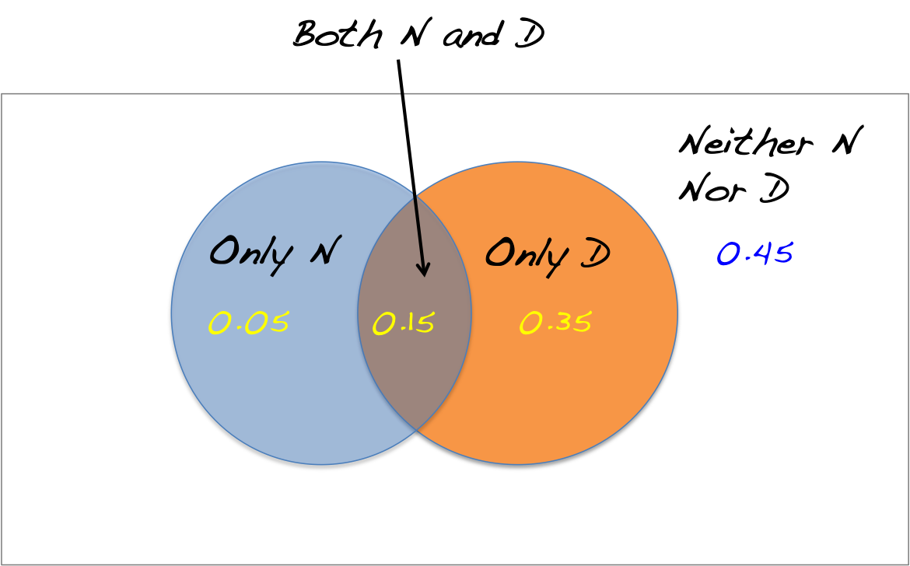

## Question 6

A statistics professor is interested in understanding the relationship between number of hours spent studying (Y) and the number of credits a student takes in a semester (X). After collecting data, he finds that both variables are normally distributed. The mean number of credits taken by students is 13.4 and the standard deviation is 2.2. The mean number of hours spent studying is 14.8 and the correlation between the two variables is 0.48. He conducts a linear regression of Y vs. X and finds that the slope equals one.

Hint. Jot down what is given, figure out what is missing, find the connection!

- $\bar{x} = 13.4, s_x = 2.2 $
- $\bar{y} = 14.8 $
- $r = 0.48 $
- $b_1 = 1$

--- &radio .quiz .smaller

## Question 6

Approximately what percentage of students study more than 21.5 hours? Select the CLOSEST answer.
	
1. 20
2. 10
3. _7_
4. 4
5. Cannot be Determined

*** explanation

We want to compute $P(Y > 21.5)$. We know that $Y$ is normally distributed with mean 14.8. If We knew the standard deviation, the probability is straight-forward to calculate. Now, we know that $b_1 = r \times s_y/s_x$. We are given $b_1 = 1$, $r = 0.48$ and $s_x = 2.2$. Plugging these values in, we get $s_y = b_1 \times s_x/r$, which equals `r 1 * 2.2/0.48`. We can now compute $P(Y > 21.5)$ using the mean and standard deviation. [Press p to see visualization of probability]

*** pnotes

```{r fig.width = 6}
gnorm(14.8, 4.58, a = 21.5)
```

--- &radio .quiz .smaller

## Question 7A

It is known that in the United States, well-educated people are less likely to smoke. But what about other nations, where there may be different cultures and/or attitudes towards smoking? In a 1998 study of the relationship between education and smoking in France, a random sample of 334 French men was classified according to their education level (elementary, high-school, or university) and their smoking habits (smoker or non-smoker).


1. This study is an experiment, since each subject was classified into one of the six possible combinations of education level and smoking habits.
2. _This study is an observational study, since researchers did not assign the men to be smokers or non-smokers, or to one of the education levels._
3. This study is an experiment, since it was based on a random sample.
4. This study is a combination of both an experiment and an observational study.

--- &radio .quiz .smaller

## Question 7B

In an experiment to see if aspirin reduces the chance of having a heart attack, a placebo is:

1. the place where the subjects go when they have a heart attack.
2. the sampling method.
3. the randomization procedure
4. a procedure for deciding who gets the aspirin treatment.	
5. _a dummy pill that looks like aspirin but has no active ingredients._

--- &radio .quiz .smaller

## Question 7C

For their 1992 study “The Effect of Country Music on Suicide” (published in Social Forces, vol. 71, p. 211), researchers Stack and Gundlach investigated various American communities, recording the number of minutes of daily radio airtime devoted to country songs and the suicide rate. They found a moderately strong positive correlation. In their paper, the researchers explain the results by saying that “…the themes found in country music foster a suicidal mood ...” (emphasis added).

<!-- A news headline (The Independent [London], October 1, 2004, p. 15) about the research echoed these sentiments when it said, “Strange But True: Country Music Saps Will to Live.” The research is even cited on various suicide-prevention websites, some with headings such as “Country Music Increases Suicide Risk.” -->

1. Based on this study, can we have confidence in causality between country music and suicide?
2. Yes, causality is indicated by the moderately strong correlation.	
3. Yes, as long as the communities were sampled randomly, and the number of communities (the sample size) was sufficiently large.
4. _No, because the lack of assignment of communities to different levels of country music listening means there is a possibility of lurking variables._
5. Yes, since different communities listened to different levels of country music, meaningful experimental comparisons can be made.

--- &radio .quiz .smaller

## Question 8A

High blood pressure is unhealthy. Here are the results of one of the studies that link high blood pressure to death from cardiovascular disease. The researchers classified a group of white males aged 35 to 64 as having Low blood pressure or High, then followed the subjects for five years. [Press p to see the study results]

What would be an appropriate calculation to do, to show the linkage between high blood pressure and cardiovascular death?

1. _conditional column percentages_
2. conditional row percentages
3. the five-number summary of both variables
4. the correlation coefficient r
5. none of these

*** explanation

To see the linkage between high blood pressure and cardiovascular death, we need to compare the probability of death for the two cases of high and low blood pressures respectively. Hence, we need the conditional probability of death given high/low blood pressure, which are the conditional column percentages.

*** pnotes


--- 

## Question 8B

Consider the following table of conditional percents.


--- .quiz &radio

## Question 8B

Which of the tables is the appropriate table of conditional percents to discover if the region where one lives affects whether or not one has health insurance?

1. _Table A_
2. Table B
3. Table C

*** explanation

Table A gives the conditional probability of being insured based on the region a person lives. Hence it is most appropriate to answer the question at hand.


--- .smaller .quiz &checkbox

## Question 9A ##

A stack of four cards contains two red cards and two black cards.  I select two cards, one at a time, and do not replace the first card selected before selecting the second card.  Consider the events: A = the first card selected is red B = the second card selected is red. The events A and B are (select ALL that apply)

1. complements.
2. disjoint.
3. uniform.
4. independent
5. _none of these_

*** explanation

It is possible for both cards selected to be Red. Hence A and B are `not disjoint`. There are only four cards in the stack. Hence if A is red, the chances that B is red are lower. Hence, A and B are `not independent`. They are not `complements` since their probabilities don't add up to one. 

--- .smaller .quiz &checkbox

## Question 9B ##

Two people are selected simultaneously and at random from a very large population. Consider the events: A = Person 1 is a Female, B = Person 2 is a Male. The events A and B are (select ALL that apply)

1. _independent_
2. uniform.
3. disjoint.
4. complements
5. none of these

*** explanation

Clearly, both A and B can happen (Person 1 is Female and Person 2 is Male). Hence A and B are `not disjoint`. They are `independent` since the population is large and hence we can assume that the probability of Person 2 being Male remains unchanged after Person 1 is picked.

--- .smaller .quiz &checkbox

## Question 9C ##

A telemarketer is calling a randomly chosen phone number. Consider the events A = Person answering is a Male, B = Person answering is a Female. The events A and B are (select ALL that apply)

1. _complements._
2. _disjoint._
3. independent
4. uniform.
5. none of these

*** explanation

The events are `disjoint` since the person answering cannot be both a male and a female. The events are `complements` since they are disjoint and collectively account for all possibilities. They are not `independent` because knowing A has happened implies that B cannot happen. They are not `uniform` since we don't know the distribution of males and females in the population.

--- .quiz &checkbox

## Question 10A

A study was done on the timeliness of flights (on-time vs. delayed) of two major airlines: StatsAir and AirMedian. Data were collected over a period of time from five major cities and it was found that StatsAir does better overall (i.e., has a smaller percentage of delayed flights). However, in each of the five cities separately, AirMedian does better.

Select ALL statements that are CORRECT.

Question options:
	
1. This situation is mathematically impossible.
2. _This is an example of Simpson's Paradox._
3. _"City" is a lurking variable in this example._
4. This is an example of a negative association between variables.

--- .quiz .smaller &radio

## Question 11A

In order to obtain a sample of undergraduate students in the United States, a simple random sample of 10 states is selected. From each of the selected states, 10 colleges or universities are chosen at random. Finally, from each of these 100 colleges or universities, a simple random sample of 20 undergraduate students is selected. Thus, the final sample consists of 2,000 undergraduates.

This is an example of:

	
1. stratified sampling
2. simple random sampling
3. _multistage sampling_
4. cluster sampling

*** explanation

This is `multistage sampling` since it employs multiple stages of sampling in its design. 

--- .quiz .smaller &radio

## Question 11B

Which of the following are examples of stratified sampling? Select ALL that apply.

1. A sample of 351 people called a radio show to express their opinions about the verdict in the Michael Jackson trial.
2. _A health educator wanted to study the sleeping habits of the undergraduate students in her university. For her study, the researcher chose a simple random sample of size 150 from each of the classes (150 freshmen, 150 sophomores, 150 juniors, and 150 seniors), for a total of 600 sampled students._
3. A poll asked a random sample of 1,112 adults whether they believe that the use of marijuana for medical reasons should be legalized.
4. The human resources department of a large bank wanted to assess the job satisfaction of the bank's workers. The department chose four of the bank's branches at random, and used all of the workers in those four branches as the subjects for the study.
5. In order to assess students' satisfaction with the food establishment on campus, the first 50 students that come out of the student center were interviewed.

*** explanation

Press p for a detailed solution

*** pnotes

The sampling design for each example is shown below.

1. Voluntary Sampling (people just call in!)
2. Stratified Sampling (break into classes, SRS from each class)
3. Simple Random Sample
4. Cluster Sampling (break into clusters, select ALL from some clusters)
5. Convenience Sample (first 50 students coming out were interviewed)

--- .quiz &checkbox .smaller

## Question 12A

A fair die is rolled 12 times. Consider the following three possible outcomes

```
5 2 6 3 2 1 4 1 6 5 3 4
1 1 2 2 3 3 4 4 5 5 6 6
6 6 6 6 6 6 6 6 6 6 6 6 
```

Select ALL statements which are TRUE.
	
1. (1) is more likely than (2) or (3)
2. It is absolutely impossible to get sequence (3)
3. (2) is more likely than (3)
4. _The three outcomes are equally likely_

*** explanation

A fair die has an equal probability of landing numbers one through six. Since, the rolls are independent, all sequences of the same length have the same probability, irrespective of the actual numbers rolled.

--- .quiz &radio .smaller

## Question 12B

In a particular game, a fair die is tossed.  If the number of spots showing is either 4 or 5 you win \\$1; if the number of spots showing is 6 you win \\$4; and if the number of spots showing is 1, 2, or 3, you win nothing.  If it costs you \\$1 to play the game, the probability that you win more than the cost of playing is:

1. 0.
2. 1/3.
3. _1/6._
4. 2/3.

*** explanation

If we let $X$ denote our winnings, then we are given that $X=1$ with probability $2/6$, $X=4$ with probability $1/6$ and $X=0$ with probability $3/6$. The probability of winning more than the cost of playing is given by $P(X > 1)$ which equals $1/6$.


---

## Question 13

According to the information that comes with a certain prescription drug, when taking this drug, there is a 20% chance of experiencing nausea (N) and a 50% chance of experiencing decreased sexual drive (D). The information also states that there is a 15% chance of experiencing both side effects.




--- .quiz &radio

## Question 13A

What is the probability of experiencing nausea or a decrease in sexual drive?

1. 0.10
2. 0.70
3. 0.85	
4. 0.40
5. _0.55_

*** explanation

The probability of experiencing N or D can be calculated by adding the probability of experiencing N with the probability of experiencing D, and subtracting the probability of experiencing both, since we are double counting it in both events. Hence, we have
$P(N or D) = 0.20 + 0.50 - 0.15 $ , which gives us 0.55.

--- .quiz &radio

## Question 13B

What is the probability of experiencing exactly one of the two side effects?
	
1. 0.10
2. _0.40_
3. 0.55
4. 0.70
5. 0.85

*** explanation

This question differs from the previous one in that we are now interested in the possibility of only one of N or D happening, not both. Hence, we just subtract the probability of both happening from the probability of N or D happening. In other words, P(N or D but NOT both) is given by P(N or D) - P(N and D), which gives us $0.55 - 0.15 = 0.40$ 

--- .quiz &radio

## Question 13C

What is the probability of experiencing neither of the side effects?
	
1. 0.85	
2. 0.40
3. _0.45_
4. 0.70
5. 0.10

*** explanation

The event experiencing NEITHER side effects is the `complement` of the event, experiencing either of the side effects. Hence the probability is just one minus the probability of experiencing either of the side effects, which gives us $1 - 0.55 = 0.45 $.

--- .quiz &radio

## Question 14A ##


I select two cards from a deck of 52 cards and observe the color of each (26 cards in the deck are red and 26 are black).  Which of the following is the most appropriate sample space S for the possible outcomes?
Question options:

1. S = {0, 1, 2}.
2. S = {red, black}.
3. _S = {(red, red), (red, black), (black, red), (black, black)}, where, for example, (red, red) stands for the event "the first card is red and the second card is red."_
4. All of these.

--- .quiz &radio

## Question 14B ##

I flip a fair coin twice and count the number of heads.  Which of the following is the correct sample space for this probability model?  (Use H to represent getting a head and T to represent getting a tail.)

1. {H, T}
2. _{HH, HT, TH, TT}_
3. {HH, HT, TT}
4. {HH, TT}

--- .quiz &radio

## Question 15A ##

A small college has 500 male and 600 female undergraduates.  A simple random sample of 50 of the male undergraduates is selected and, separately, a simple random sample of 60 of the female undergraduates is selected.  The two samples are combined to give an overall sample of 110 students.  The overall sample is:

1. a simple random sample.
2. a multistage sample.
3. _a stratified random sample._
4. all of these.

--- .quiz &radio

## Question 15B ##


A public opinion poll in Virginia wants to determine whether registered voters in the state approve of a measure to ban smoking in all public areas.  They select a simple random sample of 100 registered voters from each county in the state and ask whether they approve or disapprove of the measure.  This is an example of:

1. a simple random sample.
2. _a stratified sample._
3. a multistage sample.
4. a convenience sample.

--- .quiz &radio

## Question 15B ##

In order to select a sample of undergraduate students in the United States, I select a simple random sample of four states.  From each of these states, I select a simple random sample of two colleges or universities.  Finally, from each of these eight colleges or universities, I select a simple random sample of 20 undergraduates.  My final sample consists of 160 undergraduates.  This is an example of:

1. stratified random sampling.
2. _multistage sampling._
3. convenience sampling.
4. simple random sampling.

---

## Question 16 ##

A study of human development showed two types of movies to groups of children.  Crackers were available in a bowl, and the investigators compared the number of crackers eaten by children watching the different kinds of movies.  One kind of movie was shown at 8 AM (right after the children had breakfast) and another at 11 AM (right before the children had lunch).  It was found that during the movie shown at 11 AM, more crackers were eaten than during the movie shown at 8 AM.  The investigators concluded that the different types of movies had an effect on appetite. 

--- .quiz &radio

## Question 16A ##

The results cannot be trusted because:

1. _the time the movie was shown is a confounding variable._
2. the investigators should have used several bowls, with crackers randomly placed in each.
3. the investigators were biased.  They knew beforehand what they hoped the study would show.
4. the study was not double-blind.  Neither the investigators nor the children should have been aware of which movie was being shown.

--- .quiz &radio

## Question 16B ##


The response variable in this experiment is:

1. the time the movie was shown.
2. _the number of crackers eaten._
3. the bowls.
4. the different kinds of movies.

--- .quiz &radio

## Question 16C ##

The treatment in this experiment is:

1. the bowls.
2. _the different kinds of movies._
3. the time the movie was shown.
4. the number of crackers eaten.

---

## Question 17 ##

Twelve people who suffer from chronic fatigue syndrome volunteer to take part in an experiment to see if shark fin extract will increase one’s energy level.  Eight of the volunteers are men and four are women.  Half of the volunteers are to be given shark fin extract twice a day and the other half a placebo twice a day.  We wish to make sure that four men and two women are assigned to each of the treatments, so we decide to use a block design with the men forming one block and the women the other.

--- .quiz &radio

## Question 17A

A block design is appropriate in this experiment if:

1. we want the conclusions to apply equally to men and women.
2. _we believe men and women will respond differently to treatments._
3. gender equity is an important legal consideration in this study.
4. all of these

--- .quiz &radio

## Question 17B ##

Suppose one of the researchers is responsible for determining if a subject displays an increase in energy level.  In this case, we should probably:

1. _conduct the study as a double-blind experiment._
2. use fewer subjects but observe them more frequently.
3. use two placeboes.
4. use stratified sampling to assign subjects to treatments.

---  .quiz &radio .smaller

## Question 18 ##

John’s parents recorded his height at various ages up to 66 months.  Below is a record of the results.

```text
Age (months)      36  48  54  60  66
Height (inches)   35  38  41  43  45
```

Which of the following is the equation of the least-squares regression line of John's height on age?

1. Height = 60 – 0.22 × (Age)
2. _Height = 22.3 + 0.34 × (Age)_
3. Height = Age/12
4. Height = 12 × (Age)

*** explanation

The easiest way to answer this question is to recognize that `height` is increasing with `age`, and a baby has some `height` event at `age = 0`. The only choice that fits these criteria is (b), which has a positive intercept and a positive slope.

--- .quiz &radio

## Question 18B ##

John's parents decide to use the least-squares regression line of John's height on age to predict his height at age 21 years (252 months).  We conclude:

1. John's height, in inches, should be about half his age, in months.
2. _such a prediction could be misleading, because it involves extrapolation._
3. that the parents will get a fairly accurate estimate of his height at age 21 years because the data are clearly correlated.
4. all of these

*** explanation

This is a clear case of extrapolation. Growth is rapid initially and tapers off as a person grows holder. Expecting the linear trend to continue and making predictions based on it for values well outside the sample leads to misleading predictions.


